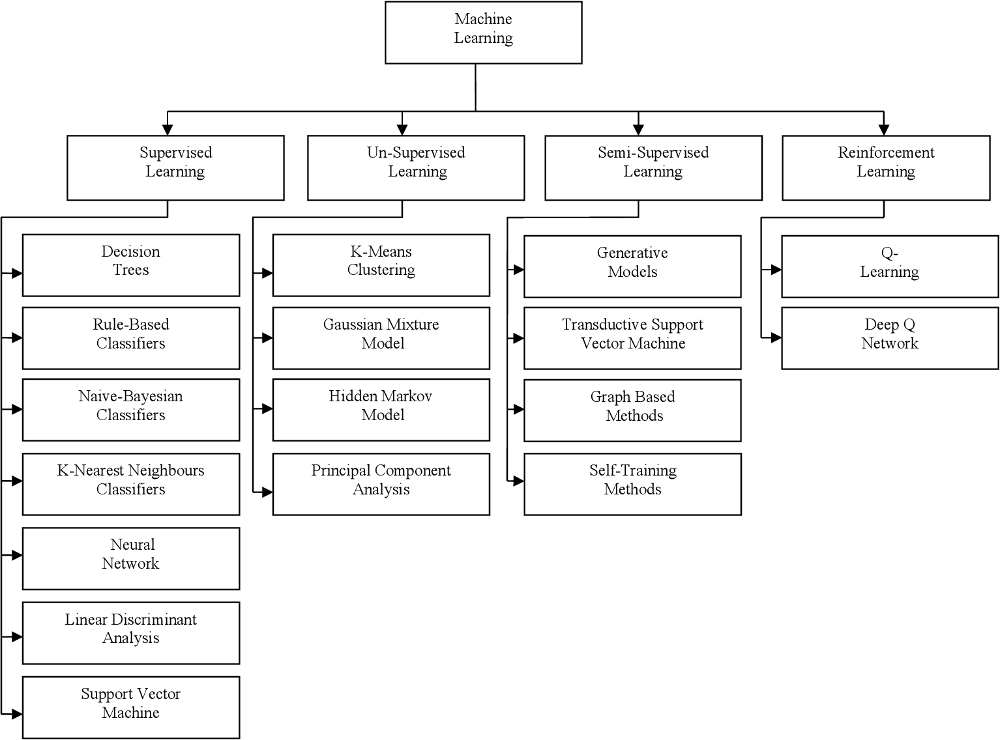

# **OG-Project**

Open Genome Project. Open-source genome database for XAI (Explainable Artificial Intelligence) Models. 

1. Aims to map out areas of interest (patterns) in various AI models that contribute to the 
    - Skill 
    - Behaviour 
    - Decision making process

    of models. 

1. Help researchers, ML engineers & decision makers
    - Better understand AI
    - Better regulate AI development
    - Create safer AI
    - Create more useful AI
    - Create "humanity aligned" AI

Check out our list of AI-Safety readings [here](/assets/resources)

## **Explaination & Visualization**

- SHAP (SHapley Additive exPlanations) | [GitHub](https://github.com/shap/shap.git) | [Website](https://shap.readthedocs.io/en/latest/) | [paper](https://arxiv.org/abs/1705.07874)

- Lime (local interpretable model-agnostic explanations) | [GitHub](https://github.com/marcotcr/lime) | [paper](https://arxiv.org/abs/1602.04938)

- ExplainerDashboard | [GitHub](https://github.com/oegedijk/explainerdashboard) | [Medium](https://medium.com/value-stream-design/making-ml-transparent-and-explainable-with-explainerdashboard-49953ae743dd)

- DALEX (moDel Agnostic Language for Exploration and eXplanation) | [GitHub](https://github.com/ModelOriented/DALEX) | [e-book](https://ema.drwhy.ai)

- Explainable Boosting Machines (EBM) | [GitHub](https://github.com/interpretml/interpret) | [paper](https://arxiv.org/abs/1909.09223)

- DiCE (Diverse Counterfactual Explanations) | [GitHub](https://github.com/interpretml/DiCE) | [paper](https://arxiv.org/abs/1905.07697)

## **Categorization**

TO BE UPDATED SOON!

